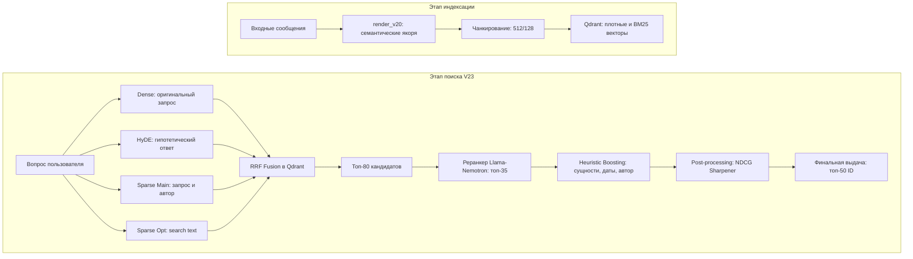

# Система интеллектуального поиска сообщений для VK Workspace

## Обзор проекта
В данном репозитории представлена высокопроизводительная поисковая система на базе архитектуры RAG, оптимизированная для экосистемы VK Workspace. Система спроектирована для обеспечения семантического поиска по фрагментированным данным корпоративного мессенджера с соблюдением строгих требований безопасности при работе в изолированном контуре.

## Метрики производительности
Эффективность системы оценивается по метрикам Recall@50 и nDCG@50. Финальная конфигурация V23 продемонстрировала значительный рост точности извлечения данных по сравнению с базовым решением.

| Метрика | Базовое решение | Итоговый результат V23 |
| :--- | :---: | :---: |
| **Итоговый балл** | 0.4600 | **0.6020** |
| **Recall@50** | - | 0.6232 |
| **nDCG@50** | - | 0.5173 |

## Архитектура системы
Решение реализует двухстадийный пайплайн обработки с использованием стратегии Super-Ensemble для обеспечения максимальной полноты и точности выдачи:



1.  **Этап индексации**:
    *   **обогащение метаданных**: сообщения структурируются с использованием семантических якорей (автор, дата, контекст треда, фрагменты файлов);
    *   **гибридное векторирование**: генерация плотных и разреженных векторов для многомодального поиска;
    *   **контекстное чанкирование**: использование адаптивного скользящего окна (512 символов с перекрытием 128) для сохранения связности диалогов.

2.  **Этап поиска**:
    *   **ансамбль Alpha-Blending**: параллельные потоки поиска, объединяющие плотные векторы (с расширением через HyDE) и разреженные векторы. Система использует **4 независимых потока** поиска для максимального покрытия;
    *   **Reciprocal Rank Fusion**: усовершенствованное слияние результатов из нескольких источников поиска внутри векторной базы данных Qdrant;
    *   **кросс-энкодерное реранжирование**: высокоточное ранжирование 35 лучших кандидатов с использованием модели Llama-Nemotron-Reranker-1B;
    *   **NDCG Sharpener**: алгоритм пост-обработки, предназначенный для диверсификации результатов и оптимизации финальной выдачи.

## Технологический стек
*   **векторная база данных**: Qdrant (v1.14.1);
*   **плотные эмбеддинги**: Qwen3-Embedding-0.6B;
*   **разреженные эмбеддинги**: FastEmbed BM25 (автономная реализация);
*   **реранкер**: Llama-Nemotron-Reranker-1B;
*   **бэкенд-фреймворк**: FastAPI (Python 3.12+).

## Развертывание
Система полностью контейнеризирована и подготовлена для работы в закрытых сетях.

### Быстрый запуск
```bash
docker-compose up --build
```

### Точки доступа сервисов
- **сервис индексации**: `http://localhost:8001`
- **сервис поиска**: `http://localhost:8002`
- **панель управления Qdrant**: `http://localhost:6333/dashboard`
