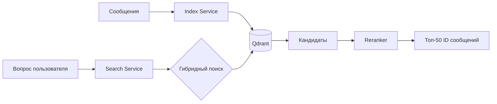

# Техническая архитектура системы

Система построена по микросервисной архитектуре и состоит из двух основных сервисов, взаимодействующих через векторную БД Qdrant.

## Общая схема
1.  **Index Service**: Превращает сырые сообщения в "умные" чанки и сохраняет их в Qdrant.
2.  **Qdrant**: Хранит векторные представления (Dense и Sparse) и метаданные.
3.  **Search Service**: Принимает вопрос, выполняет многопоточный поиск и переранжирует результаты.

## Технологический стек
*   **Язык**: Python 3.12 (FastAPI).
*   **Векторная БД**: Qdrant (поддержка гибридного поиска).
*   **Dense Embeddings**: Qwen3-Embedding-0.6B (семантический смысл).
*   **Sparse Embeddings**: BM25 через FastEmbed (точный поиск по ключевым словам).
*   **Reranker**: Llama-Nemotron-Rerank-1B (финальная оценка релевантности).

## Поток данных (Data Flow)

## Особенности реализации
*   **Air-gap Ready**: Система полностью автономна и не требует доступа в интернет (используются локальные модели и прокси-инференс).
*   **RRF (Reciprocal Rank Fusion)**: Алгоритм объединения результатов векторного и текстового поиска для достижения максимальной точности.
